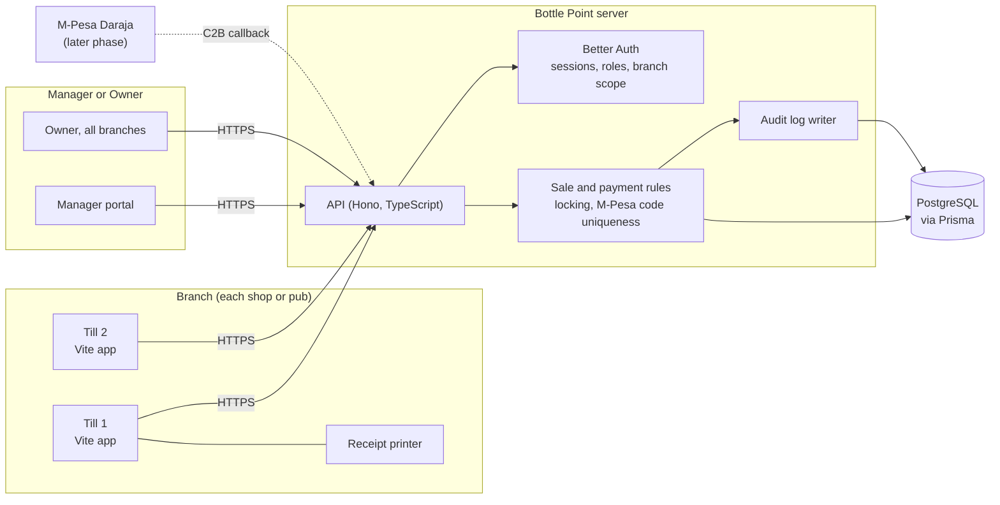
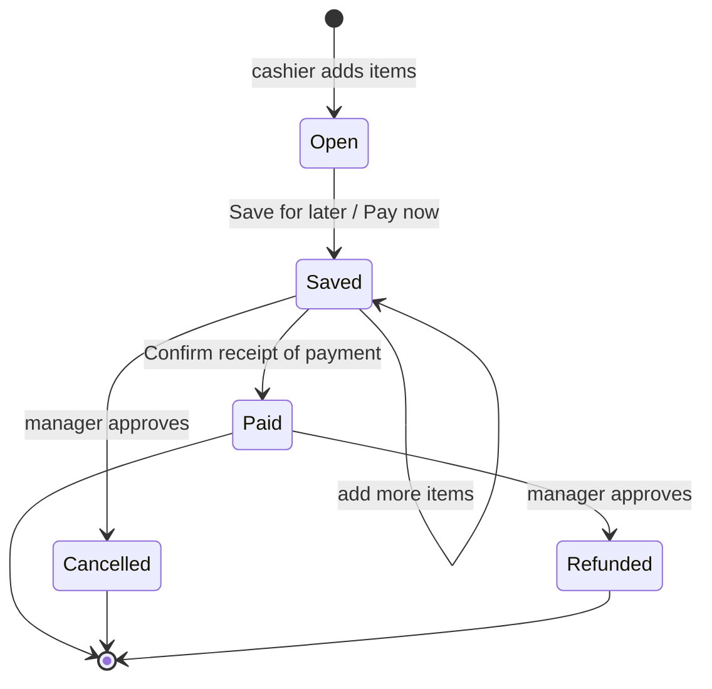
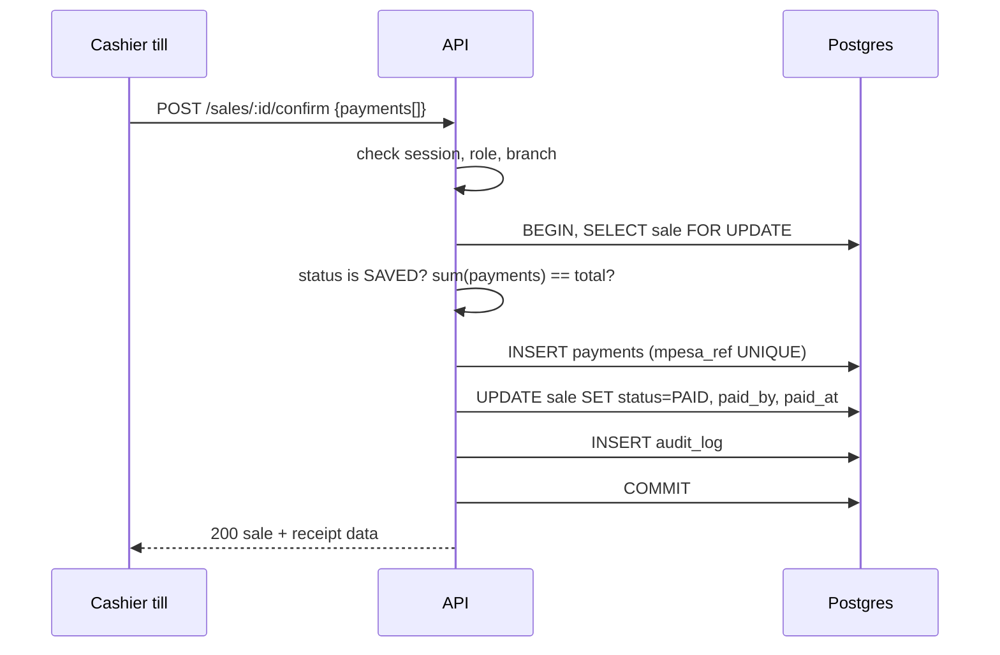

# Bottle Point

Point of sale for wines and spirits shops and local pubs. One business, many branches.

**Core rule:** a sale is saved the moment it is recorded. It only counts as paid once a cashier confirms receipt of payment and that payment is linked to the sale.

---

## 1. Stack

| Layer | Choice | Why |
|---|---|---|
| Frontend | Vite, React, TypeScript | Fast dev loop, small bundle, runs well on cheap till hardware |
| Styling | Plain CSS with tokens (see `web/src/styles.css`) | Full control of the black and brass look, no framework noise |
| API | Node, Hono (or Express), TypeScript | Thin, typed HTTP layer in front of Prisma |
| Auth | Better Auth | Sessions, username plus PIN, role and branch claims |
| ORM | Prisma | Typed schema, migrations, transactions |
| Database | PostgreSQL (local first) | Real constraints, row locking, numeric money |
| Validation | Zod, shared between web and API | One source of truth for request shapes |

Money is stored as integer cents (`Int`, KSh x 100). No floats anywhere.

---

## 2. Architecture



### Sale lifecycle



### Confirm payment, server side



If the M-Pesa code is already used, the unique index fails the insert and the whole transaction rolls back. The cashier sees "This code is already linked to another sale".

---

## 3. Data model (Prisma, first cut)

```prisma
enum Role       { CASHIER MANAGER OWNER }
enum SaleStatus { OPEN SAVED PAID CANCELLED REFUNDED }
enum PayMethod  { CASH MPESA }

model Business { id String @id @default(cuid()) name String branches Branch[] users User[] }

model Branch {
  id String @id @default(cuid())
  businessId String
  name String
  business Business @relation(fields: [businessId], references: [id])
  sales Sale[]
  shifts Shift[]
  stock Stock[]
}

model User {
  id String @id @default(cuid())
  businessId String
  username String @unique
  name String
  role Role
  active Boolean @default(true)
  branches UserBranch[]          // which branches this person may act in
}

model UserBranch { userId String branchId String @@id([userId, branchId]) }

model Product {
  id String @id @default(cuid())
  businessId String
  name String
  sizeMl Int
  category String
  barcode String?
  priceCents Int
  @@unique([businessId, barcode])
}

model Stock { branchId String productId String qty Int @@id([branchId, productId]) }

model Shift {
  id String @id @default(cuid())
  branchId String
  userId String
  openedAt DateTime @default(now())
  openingFloatCents Int
  closedAt DateTime?
  countedCashCents Int?
  expectedCashCents Int?
}

model Sale {
  id String @id @default(cuid())
  number Int                      // per branch, human readable
  branchId String
  createdById String
  label String?
  status SaleStatus @default(OPEN)
  totalCents Int
  paidById String?
  paidAt DateTime?
  createdAt DateTime @default(now())
  lines SaleLine[]
  payments Payment[]
  @@unique([branchId, number])
  @@index([branchId, status, createdAt])
}

model SaleLine {
  id String @id @default(cuid())
  saleId String
  productId String
  name String                     // snapshot at time of sale
  unitCents Int                   // snapshot, price changes never rewrite history
  qty Int
}

model Payment {
  id String @id @default(cuid())
  saleId String                   // exactly one sale
  method PayMethod
  amountCents Int
  mpesaRef String? @unique        // one code, one sale, ever
  receivedById String
  shiftId String
  createdAt DateTime @default(now())
}

model Approval {                   // cancellations, refunds, discounts
  id String @id @default(cuid())
  saleId String
  kind String
  requestedById String
  approvedById String?
  reason String
  createdAt DateTime @default(now())
}

model AuditLog {
  id BigInt @id @default(autoincrement())
  at DateTime @default(now())
  userId String
  branchId String
  action String
  entity String
  entityId String
  data Json
}
```

---

## 4. Security

1. **Auth.** Better Auth with username plus a 4 to 6 digit PIN. PINs hashed with argon2id. Lock the user for 5 minutes after 5 wrong PINs. Session cookie is `HttpOnly`, `Secure`, `SameSite=Strict`, short idle timeout on tills (15 minutes) and longer for owners.
2. **Owner and manager accounts** also get a password and optional TOTP, since they can see money across branches.
3. **Authorisation on the server, every request.** Middleware resolves `user`, `role`, and the set of allowed `branchId`s. Every query is scoped by branch. The frontend hiding a button is never the control.
4. **Money rules live in the database too.** `mpesaRef` unique index, `CHECK (amount_cents > 0)`, payment sum equals total checked inside the transaction with the sale row locked (`SELECT ... FOR UPDATE`).
5. **Paid sales are immutable.** Only a refund record (with a manager approval) can reverse one. No `UPDATE` route touches a paid sale's lines.
6. **Audit log is append only.** The app's DB role has `INSERT` but no `UPDATE` or `DELETE` on `audit_log`.
7. **Input validation** with Zod on every route. Prisma parameterises all queries.
8. **Transport.** HTTPS only, HSTS, strict CSP, CORS locked to the app origin, rate limiting on login and payment routes.
9. **Secrets** in `.env`, never committed. Separate DB users for migrations and for the running app.
10. **Backups.** Nightly `pg_dump`, encrypted, kept off the machine. Test a restore monthly.

---

## 5. API outline

| Method | Path | Who |
|---|---|---|
| POST | `/auth/pin` | everyone |
| POST | `/shifts` open, `/shifts/:id/close` | cashier+ |
| GET | `/products?q=&barcode=` | cashier+ |
| POST | `/sales` | cashier+ |
| PATCH | `/sales/:id/lines` (only while OPEN or SAVED) | cashier+ |
| GET | `/sales?status=SAVED` unpaid list for the branch | cashier+ |
| POST | `/sales/:id/confirm` with payments | cashier+ |
| POST | `/sales/:id/cancel-request`, `/refund-request` | cashier+ |
| POST | `/approvals/:id/approve` | manager+ |
| GET | `/reports/daily?branch=&date=` | manager+ |
| GET | `/reports/reconcile?shift=` | manager+ |
| GET | `/reports/branches?date=` | owner |
| CRUD | `/products`, `/prices` | manager+ |
| CRUD | `/branches`, `/users` | owner |

---

## 6. Repo layout

```
Bottle Point/
  PLAN.md
  docs/logo.svg
  web/            Vite app (demo running now)
  server/         API, Better Auth, Prisma (next)
    prisma/schema.prisma
    src/routes/
    src/rules/    sale, payment, approval logic
    src/auth/
  packages/shared Zod schemas and types used by web and server
```

---

## 7. Phases

**Phase 0, now: clickable demo.** Done in `web/`. In memory data, all screens: sign in, open shift, till, pay (cash, M-Pesa, split), receipt, unpaid list, transactions, refunds with manager approval, inventory, customers, daily sales with till reconciliation, branch comparison. Hardware barcode scanners (USB or Bluetooth, keyboard mode) work anywhere on the till.

**Phase 1: backend foundation.**
Postgres locally, Prisma schema and seed, Better Auth with PIN login, role and branch middleware, products and sales routes.

**Phase 2: connect the till.**
Replace in memory state with API calls (TanStack Query). Confirm payment through the locked transaction. Receipt printing through the browser print dialog (58mm and 80mm CSS).

**Phase 3: manager and owner.**
Daily report queries, shift close and reconciliation, approvals queue, branch comparison, user and branch admin.

**Phase 4: hardening.**
Rate limits, audit views, backups, offline queue on the till (save sales locally if the network drops, sync after).

**Phase 5: M-Pesa integration.**
Daraja C2B callbacks land in an `incoming_payments` table. The till shows unlinked payments and the cashier links one to a sale with a tap.

---

## 8. Running the demo

```
cd web
npm install
npm run dev
```

Open http://localhost:5173. Any listed user, PIN `1234`.

- Wanjiru or Brian: cashier view
- Otieno: manager, adds Inventory and Daily sales
- Achieng: owner, adds Branches

Light and dark themes: the sun or moon button top right. It follows the system setting until you pick one, then remembers it.
