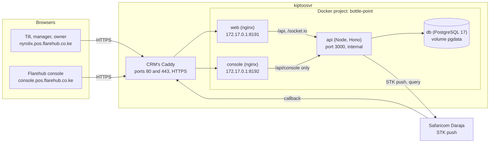

# Architecture

## The pieces



- **web** serves the till app and forwards `/api` and `/socket.io` to the API. It refuses `/api/console`.
- **console** serves the console app and forwards only `/api/console`. Every other API path answers 404 there.
- **api** is one Node process: HTTP API, Socket.IO for live updates, the M-Pesa sweeper and the billing scheduler.
- **db** is PostgreSQL. Nothing outside the Docker project can reach it.

## Clients and addresses (tenancy)

One database holds every client. A client is a `Business` with a unique `slug` (`nyrolix`), and its address is `<slug>.pos.flarehub.co.ke`.

- The API reads the shop from the request's `Host` header (`src/lib/tenant.ts`). It ignores `X-Forwarded-Host`, so the shop cannot be forged.
- Signing in on a shop's address only works for that shop's staff. Anyone else gets the same answer as a wrong PIN.
- Every request checks that the session's business matches the address. A session taken to another shop's address is refused.
- Inside the API every query is scoped to the signed in person's business and branches. Loading another business's record by id answers 404.
- Without `TENANT_BASE_DOMAIN` (local development) there is no address check.

## Who can do what

| Role | Where | Can |
|---|---|---|
| Cashier | Till | Sell, take payments, save unpaid sales, customers, ask for refunds, discounts and cancellations |
| Manager | Till | Everything a cashier can, plus stock, reports, approving requests, checking typed M-Pesa codes, closing any till |
| Owner | Till | Everything, in every branch, plus staff, branches and Settings |
| Support | Console | Clients, onboarding, suspending, owner PIN resets, notes, extending trials |
| Billing | Console | Plans, subscriptions, invoices, payments, the billing run, extending trials |
| Super admin | Console | Everything, including the team |

## Money rules

- All money is whole cents in integers (`totalCents`), never decimals. Percentages are basis points (`1600` is 16%).
- A sale is saved the moment it is recorded (`SAVED`). It becomes `PAID` only when payments linked to it cover the total.
- `applyPayment` in `src/rules/sale-core.ts` is the only code that writes payments or marks a sale paid. It locks the sale row, refuses overpayment, refuses an M-Pesa code that was already used, and takes stock off exactly once.
- The database enforces the same rules again with CHECK constraints: amounts positive, totals add up, an M-Pesa code is unique, one open shift per cashier per branch, invoice totals add up, and the activity log cannot be changed or deleted.
- Cash cannot land in a shift that is being closed. M-Pesa confirmations that arrive late are recorded without a shift.

## M-Pesa

1. **STK push first.** The till asks the API to send a prompt to the customer's phone. Safaricom calls back with the result, and the callback must match the request by `CheckoutRequestID` and the amount.
2. **Status query.** If the callback does not come, the sweeper asks Safaricom for the result. Requests with no answer time out.
3. **Typed code fallback.** The cashier types the code from the customer's SMS. It is saved as unverified until a manager checks it on the statement.
4. **Per shop settings.** Each shop can save its own Paybill or Till and Daraja keys (encrypted with AES-256-GCM, `src/lib/secrets.ts`). Without them the server-wide setting applies, which is the simulation in production today.

## Billing (the platform's own)

- A `Plan` is priced one of four ways: flat, per branch, share of sales, or one time licence. `src/rules/pricing.ts` prices every invoice, estimate and revenue figure, so the numbers always agree.
- A `Subscription` moves between `TRIALING`, `ACTIVE`, `PAST_DUE`, `SUSPENDED` and `CANCELLED`.
- The billing run (`src/rules/billing.ts`) runs every hour and can be run by hand from the console. It ends trials, starts new periods, raises invoices (in advance, or after the period for share of sales), marks clients past due 7 days after the due date, and suspends them after 21 days. It is safe to run twice.
- A suspended or cancelled shop can still sign in and see its billing page, but cannot sell. The till shows "Selling is paused".

## Live updates

Socket.IO on the same origin. A socket is accepted only with a valid session on the right address, and joins a room per branch and per business. Events: `sale:updated`, `mpesa:updated`, `approval:updated`, `stock:updated`, `shift:updated`, `product:updated`. Payloads are the whole updated object, so a screen replaces what it has.

## Code map

```
server/
  prisma/schema.prisma     the data model
  prisma/migrations/       every database change, including CHECK constraints
  prisma/seed.ts           demo data for local development only
  src/app.ts               routes, origin checks, error handling
  src/auth.ts              Better Auth (sessions, PIN and password hashing)
  src/middleware/          shop roles and branches, platform roles
  src/lib/tenant.ts        address to client, trusted origins
  src/rules/               the business rules (sales, payments, M-Pesa, pricing, billing, reports)
  src/routes/              HTTP endpoints, one file per area
  src/routes/console/      the console API
  src/routes/settings/     the owner's Settings API
  test/                    Vitest against a real database
web/src/                   the till app
console/src/               the console app
deploy/                    compose file, nginx configs, deploy, sites and backup scripts
```

## Local development

```
cd server
cp .env.example .env            # set BETTER_AUTH_SECRET and MPESA_CALLBACK_TOKEN
npm install
npm run db:up                   # Postgres in Docker on 127.0.0.1:5544
npm run db:deploy
npm run db:seed                 # demo data, every PIN 1234, local only
npm run dev                     # API on :3000

cd ../web && npm install && npm run dev          # till on :5173
cd ../console && npm install && npm run dev      # console on :5174
```

Locally there is no address check, so the till at `http://localhost:5173` signs in any demo user. Create a console user with `npm run platform:admin -- you@example.com "Your Name"` in `server/`.
